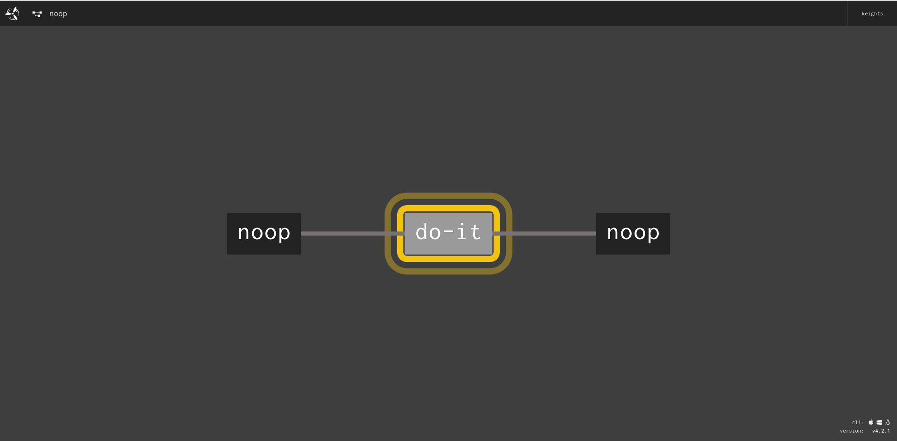
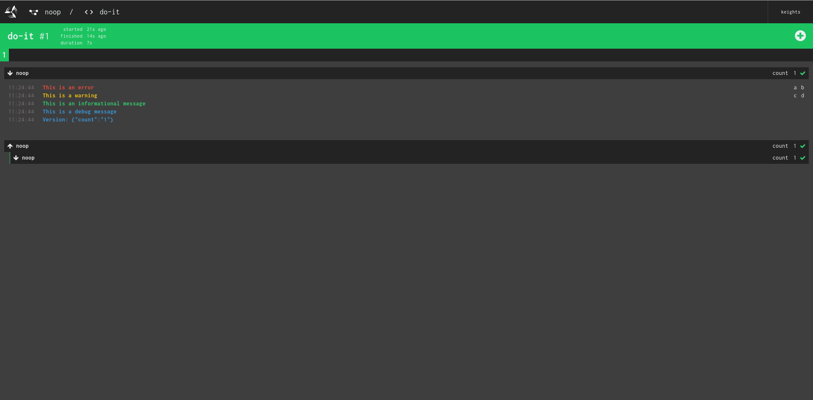

# ofcourse

This is a library and a project skeleton generator for making your own [Concourse](https://concourse-ci.org/) resources in [Go](https://golang.org/), with an emphasis on testability.

A Concourse resource consists of a Docker image containing three executables: `/opt/resource/check`, `/opt/resource/in`, and `/opt/resource/out`. When these are called by Concourse, they receive a JSON payload through standard input. They communicate back to Concourse by printing JSON back to standard output.

This library reduces the amount of boilerplate required by allowing you to implement just three methods `Check`, `In`, and `Out`, which handles the serializing of JSON to and from standard output and input. The methods instead receive all of their inputs via arguments, and send their output through normal return values.

The project skeleton generator creates a simple resource that works out of the box. The project includes a Dockerfile, a Makefile, and a test suite with coverage for `Check`, `In`, and `Out`. There is also a sample pipeline that you can use to try out the resource immediately after running `make`, which builds the image and pushes it to your registry.

# Generating a Project

First read the [official documentation](https://concourse-ci.org/implementing-resources.html) on implementing your own resource.

Download and unzip the latest `ofcourse` release from [GitHub](https://github.com/cloudboss/ofcourse/releases).

```
> curl -O https://github.com/cloudboss/ofcourse/releases/download/v0.1.0/ofcourse_linux_amd64.zip
> unzip ofcourse_linux_amd64.zip
```

Put the `ofcourse` binary in a directory on your `PATH`, or run it directly from the current location with `./ofcourse`.

The `ofcourse` binary contains one subcommand called `init`, which takes three arguments:

* `-R, --docker-registry` - This is the docker registry where you will push your image. This may be an image on docker hub such as `cloudboss/concourse-noop-resource` or a fully qualified name such as `artifactory.example.com/cloudboss/concourse-noop-resource`.

* `-i, --import-path` - This is the Go import path for your project, often a GitHub repository like `github.com/cloudboss/concourse-noop-resource`.

* `-r, --resource` - This is the name of the resource. A directory of this name will be created, and this name will be used to refer to your resource in the sample pipeline.

Run `ofcourse init` to generate a project:

```
> ./ofcourse init -R cloudboss/concourse-noop-resource -i github.com/cloudboss/concourse-noop-resource -r noop
```

Change to the directory that was created and build the docker image:

```
> cd noop
> make
```

Now push the image to your registry. Note that you may need to [log in](https://docs.docker.com/engine/reference/commandline/login/) to the registry before running this.

```
> make publish
```

Now that the image has been pushed to a registry, you can create the sample pipeline with the `fly` command:

```
> fly -t mytarget set-pipeline -p noop -c pipeline.yml
> fly -t mytarget unpause-pipeline -p noop
```

Soon after creating the pipeline, the resource will be checked.


After the check produces a version, the `do-it` job will trigger.



The output of `get` is shown here, with colored log levels, and metadata displayed on the right.



Continue development to make it do something useful, testing as you go.

```
> make test
go test -v ./...
go: finding github.com/cloudboss/ofcourse/ofcourse latest
go: finding github.com/cloudboss/ofcourse latest
go: finding github.com/stretchr/testify/assert latest
?   	github.com/cloudboss/concourse-noop-resource/cmd/check	[no test files]
?   	github.com/cloudboss/concourse-noop-resource/cmd/in	[no test files]
?   	github.com/cloudboss/concourse-noop-resource/cmd/out	[no test files]
=== RUN   TestCheck
--- PASS: TestCheck (0.00s)
=== RUN   TestIn
--- PASS: TestIn (0.00s)
=== RUN   TestOut
--- PASS: TestOut (0.00s)
PASS
ok  	github.com/cloudboss/concourse-noop-resource/resource	0.003s
```

# Project Makefile

The project Makefile contains the following targets:

`docker`: This does a `docker build`, and is the default `make` target.

`publish`: This does a `docker push`.

`test`: This runs the project's go tests.

`fmt`: This runs `gofmt` on the project's go files.

For the `docker` and `publish` targets, if `VERSION` is passed to `make`, then the docker image will be tagged with that version.

```
> make VERSION=1.2.3
> make publish VERSION=1.2.3
```

# Project README

A skeleton `README.md` file is generated for the project, which should be filled in with valid descriptions, and should document the source config and parameters required to make the resource function properly. The format follows the ones used by builtin Concourse resources, for example the [git resource](https://github.com/concourse/git-resource) or the [s3 resource](https://github.com/concourse/s3-resource).

# Logging

Since Concourse resources communicate back to Concourse over standard output, they cannot print information to standard output. For this reason, each of the `Check`, `In`, and `Out` methods receive a `logger` argument that will print to standard error, using colored log levels. The log level may be configured in the `source` of every resource that uses the `ofcourse` library. The available levels are `debug`, `info`, `warn`, `error`, and `silent`.

```
resources:
- name: noop
  type: noop
  check_every: 5m
  source:
    # Every resource created using ofcourse will have `log_level`
    # as an available option in the source configuration. If not
    # given, it defaults to `info`.
    log_level: debug
```

The logger has methods `Debugf`, `Infof`, `Warnf`, and `Errorf` for printing formatted strings to the Concourse UI.

The `silent` level is useful for unit tests, so that log output does not interfere with test output.

```go
var (
        testLogger = ofcourse.NewLogger(ofcourse.SilentLevel)
)

```

# Environment

Concourse passes [metadata](https://concourse-ci.org/implementing-resources.html#resource-metadata) about the build as environment variables to `in` and `out` commands. The `ofcourse` methods all receive an `environment` argument, which is a structure with `Get` and `GetAll` methods for retrieving the environment variables. This was done to make writing tests easier, so that fake environments can be passed in unit tests. The `check` command does not receive the Concourse metadata, however the `Check` method that uses this library still receives the environment argument for ease of testing in case it is useful. After all, there are other environment variables besides the ones passed explictly by Concourse.

A new environment using the current environment's variables may be created with `NewEnvironment` without any arguments.

```go
	env := ofcourse.NewEnvironment()
```

The variables may be explicitly passed in as well:

```go
	vars := map[string]string{
		"BUILD_ID":            "1",
		"BUILD_NAME":          "1",
		"BUILD_JOB_NAME":      "do-it",
		"BUILD_PIPELINE_NAME": "noop",
		"BUILD_TEAM_NAME":     "noop",
		"ATC_EXTERNAL_URL":    "https://concourse.example.com",
	}
	env := ofcourse.NewEnvironment(vars)

	// Tests here using the environment...
```

You may call `env.Get` with or without a default value. The normal default is to return an empty string when the environment variable is not set.

```go
	buildName := env.Get("BUILD_NAME")
	buildJobName := env.Get("BUILD_JOB_NAME", "one-off")
```

You may call `env.GetAll` to get a `map[string]string` of the whole environment.

```go
	variables := env.GetAll()
```

# Source

Every Concourse resource, when defined in a pipeline, may set its configuration in a key called `source`, which has an implementation defined structure. `ofcourse` has a `Source` data type to represent this. Under the hood, it is a `map[string]interface{}`. This is passed to `Check`, `In`, and `Out` methods.

# Params

Every `get` or `put` on a Concourse resource in a pipeline may define a `params` key. Like `source`, its structure is defined by the implementation. `ofcourse` defines this as `Params`, which is a `map[string]interface{}`. This is passed to `In` and `Out` methods.

```
jobs:
- name: do-it
  plan:
  - get: noop
    trigger: true
  - put: noop
    params:
      version_path: noop/version
```

# Version

Versions in Concourse are arbitrary key/value pairs of strings. `ofcourse` represents this as a `Version`, which is a `map[string]string`. This is passed to `Check` and `In` methods.

# Metadata

`In` and `Out` methods may display metadata in the Concourse UI by returning `Metadata`. This is an array of `NameVal` structs, each of which has fields `Name` and `Value`. It must be returned from `In` and `Out` methods, but may be empty if not needed.

```go
	metadata := ofcourse.Metadata{
		{
			Name: "a",
			Value: "b",
		},
		{
			Name: "c",
			Value: "d",
		},
	}
```

# Check

`Check` is called when Concourse does a resource check, or when a user runs `fly check-resource`. The method has the following signature:

```go
Check(source Source,
	version Version,
	env Environment,
	logger *Logger) ([]Version, error)
```

`Check` must return an array of `Version`s, which should be all versions since the `version` argument. When called the first time, the `version` argument will have a value of `nil`, and the returned versions array should contain just one item. An empty array may be returned if there is no version.

# In

`In` is called when a pipeline job does a `get` on the resource. The method has the following signature:

```go
In(outputDirectory string,
	source Source
	params Params,
	version Version,
	env Environment,
	logger *Logger) (Version, Metadata, error)
```

The `outputDirectory` argument is where any artifacts retrieved from `Source` should be placed. `In` must return `Version` and `Metadata`, though both may be empty.

# Out

`Out` is called when a pipeline job does a `put` on the resource. The method has the following signature:

```go
Out(inputDirectory string,
	source Source
	params Params,
	env Environment,
	logger *Logger) (Version, Metadata, error)
```

The `inputDirectory` argument is a directory containing subdirectories for all resources retrieved with `get` in a job, as well as all of the job's task outputs. The path to any specific files needed by `Out` should be defined in the `put` `params` in the pipeline, which will be available in the `Params` argument. `Out` must return `Version` and `Metadata`, though both may be empty.
